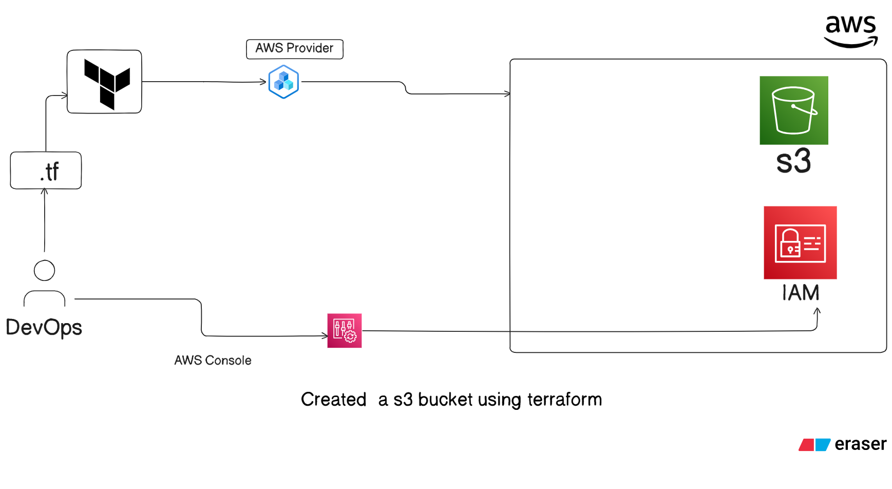
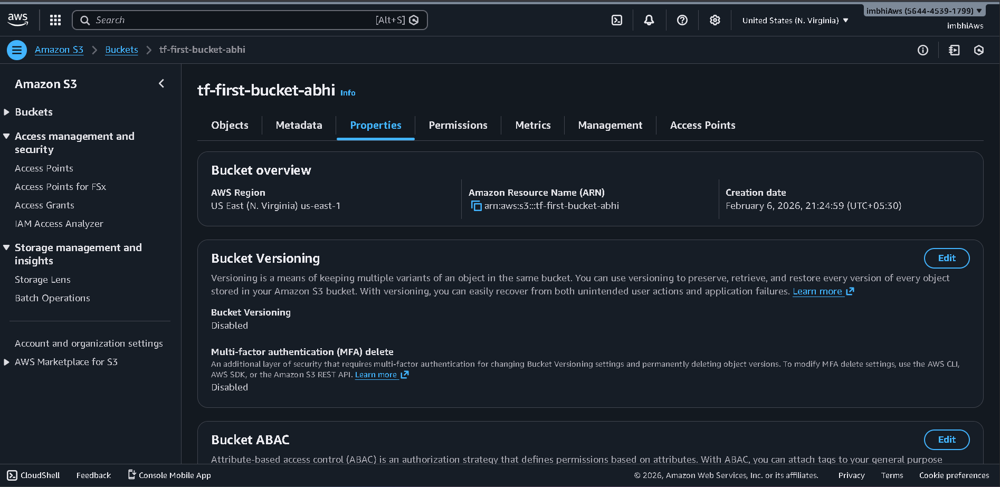

Ohhh nice 👌 adding architecture diagram makes it look 10x more professional on GitHub.

Let’s update your `README.md` properly and include the Eraser.io architecture section in a clean way.

You just need to export your Eraser diagram as PNG/JPG and place it inside your project folder like this:

```
Day-03/
├── main.tf
├── README.md
└── architecture/
      └── day03-architecture.png
```

Now here’s the updated README with architecture section included:

---

# Terraform + AWS S3 Infrastructure (Day 03 Hands-on)

This project demonstrates how to provision AWS infrastructure using **Terraform**.
In this setup, I created an S3 bucket using Infrastructure as Code (IaC) and authenticated securely using an IAM user.

---

## Project Objective

- Create an IAM user with S3 access
- Configure AWS CLI credentials locally
- Define AWS provider in Terraform
- Provision an S3 bucket using Terraform
- Verify infrastructure creation in AWS Console
- Document architecture using Eraser.io

---

# Architecture Diagram

Below is the high-level architecture of what was implemented on Day 03:



### Architecture Flow:

1. IAM User is created with S3 permissions
2. AWS CLI configured using Access Key & Secret Key
3. Terraform authenticates using configured credentials
4. Terraform communicates with AWS Provider
5. S3 bucket is provisioned in selected AWS region

This visualization helped in understanding authentication flow and resource provisioning clearly.

---

# 1️⃣ Create IAM User (AWS Console)

### Step 1: Login to AWS Console

Go to **IAM → Users → Create User**

### Step 2: Set User Details

- User name: `terraform-user`
- Enable: Programmatic access

### Step 3: Attach Permissions

Attach policy:

```
AmazonS3FullAccess
```

### Step 4: Save Credentials

Download:

- Access Key ID
- Secret Access Key

---

# 2️⃣ Configure AWS CLI

```bash
aws configure
```

Provide:

```
AWS Access Key ID
AWS Secret Access Key
Region (example: ap-south-1)
Output format: json
```

---

# 3️⃣ Terraform Provider Configuration

`provider.tf`

```hcl
provider "aws" {
  region = "us-east-1"
}
```

---

# 4️⃣ S3 Bucket Resource Definition

`main.tf`

```hcl
#create a s3 bucket
resource "aws_s3_bucket" "example" {
  bucket = "tf-first-bucket-abhi"
  tags = {
    Name        = "My Demo-bucket"
    Environment = "Dev"
  }
}
```

---

# 5️⃣ Terraform Workflow

### Initialize

```bash
terraform init
```

Downloads provider plugins and prepares working directory.

---

### Plan

```bash
terraform plan
```

Shows execution plan before making changes.

---

### Apply

```bash
terraform apply
```

Creates the infrastructure and generates `terraform.tfstate`.

---

# Verification

After successful apply:

- Login to AWS Console
- Navigate to S3
- Confirm bucket creation - 
  

---

# Concepts Practiced

- IAM user & access management
- AWS CLI configuration
- Provider block configuration
- Resource provisioning with Terraform
- State file management
- Architecture documentation

---
